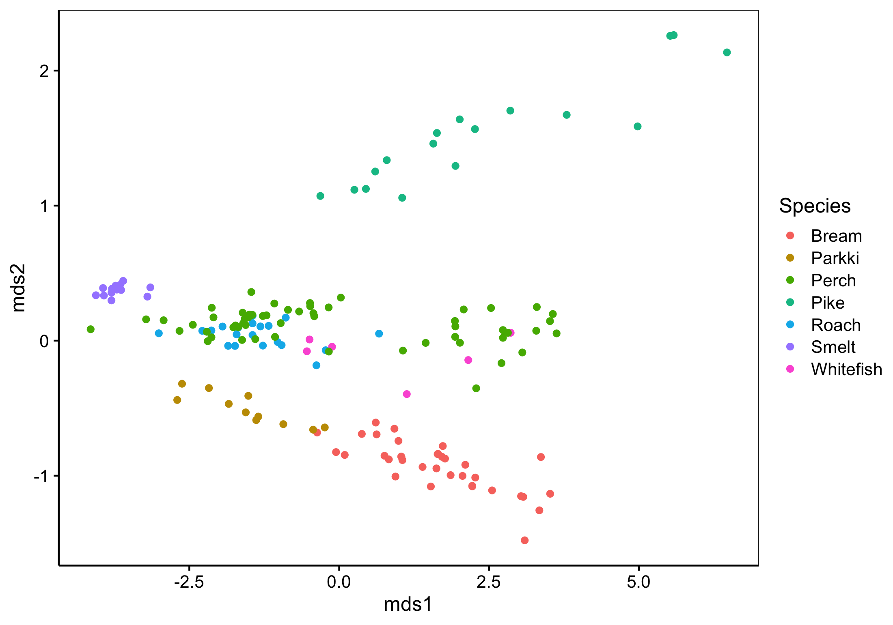

# Recensement de 

**Cet exercice est en cours de préparation.**

## Avant-propos

Les consignes reprises dans ce document, ainsi que dans les différents fichiers sont susceptibles d'évoluer. N'hésitez pas à vérifier le lien suivant afin de voir si des modifications n'y ont pas été apportées : <https://github.com/BioDataScience-Course/B06Ia_fish-market>.

Avant d'aborder ce projet, assurez-vous d'avoir bien compris le contenu du [module 6](https://wp.sciviews.org/sdd-umons2/?iframe=wp.sciviews.org/sdd-umons2-2020/k-moyenne-mds-som.html) du cours de SDDII.

## Objectifs

TODO 

## Consignes

Complétez le fichier `fish_kmeans.Rmd` afin de comparer les résultats obtenu avec la classification hiérarchique ascendantes et les k-moyennes.

Complétez le fichier `fish_mds.Rmd` afin de reproduire ce le graphique ci-dessous.

{width='60%'}

